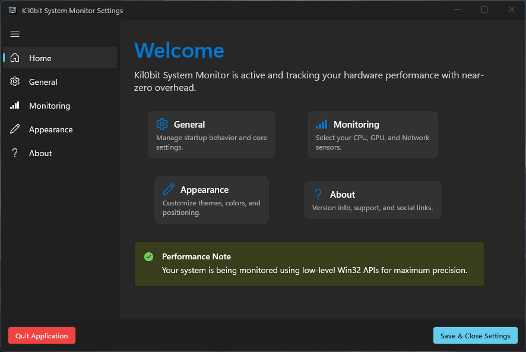
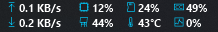
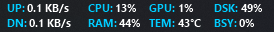
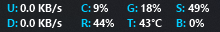
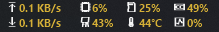

# kil0bit System Monitor

<div align="center">


**The high-precision, low-latency system monitor for Windows 11.**  
Built with C#, WinUI 3, and raw Win32 power  

[Download v2.0.0](https://github.com/kil0bit-kb/kil0bit-system-monitor/releases/latest) | [User Guide](GUIDE.md) | [Report Bug](https://github.com/kil0bit-kb/kil0bit-system-monitor/issues)

[](https://github.com/kil0bit-kb/kil0bit-system-monitor/releases)
[](LICENSE)
[](https://dotnet.microsoft.com/en-us/download/dotnet/10.0)

</div>

---

## ✨ Why kil0bit System Monitor?

Kil0bit System Monitor is a modern successor to legacy taskbar monitors. It’s designed specifically for **Windows 11 power users** who need accurate, real-time metrics without the bloat of Electron or the overhead of high-level monitoring tools.

### 📊 Core Features
- **🚀 Ultra-Low Overhead** — Uses low-level Win32 APIs and GDI+ for near-zero CPU usage.
- **🖥️ Taskbar Integration** — Sits directly inside your taskbar. Always visible, never in your way.
- **📐 Flexible Layout** — Enable "Snap to Taskbar" for a native look, or disable it to **free-float** the overlay anywhere on your desktop.
- **🏠 Interactive Dashboard** — A modern WinUI 3 control center with quick-link navigation.
- **🎨 Pixel-Perfect Design** — Glassmorphism, Mica effects, and fully customizable themes.
- **🛡️ High-DPI Ready** — Precision rendering that looks sharp on 4K, Ultrawides, and multi-monitor setups.
- **⚙️ Power-User Settings** — Customize sensors (CPU, GPU, Network), colors, and smart startup behavior.

---

## ✨ v2.0.0 Highlights
- **🚀 C#/.NET 10.0 Engine**: Re-engineered for maximum performance and ultra-low CPU overhead.
- **🏠 Interactive Dashboard**: A sleek, zero-scroll Control Center with quick-link navigation.
- **🎨 Custom Styling**: New Pro Themes (Cyberpunk, Matrix, Stealth) and high-DPI icons.
- **🛡️ Smart Monitoring**: Zero-allocation GDI+ rendering with background/foreground smart detection.

## 📸 Screenshots

### 🛠️ Professional Dashboard


### 📊 Transparent Overlays
````carousel

<!-- slide -->

<!-- slide -->

<!-- slide -->

````

---

## 📥 Installation

### 1. Download the Artifacts
Head over to the [**Releases**](https://github.com/kil0bit-kb/kil0bit-system-monitor/releases) page and download:
- **`Kil0bitSystemMonitor.exe`**: A self-contained, portable executable.

### 2. Run & Enjoy
Just double-click the EXE. The app will automatically initialize the overlay and open the Settings dashboard for your first configuration.

---

## 🔨 Build from Source

### Prerequisites
- **Visual Studio 2022** (17.10+) with the "Windows App Development" workload.
- **.NET 10.0 SDK**.
- **Windows 11** (recommended) or Windows 10 (Build 19041+).

### Steps
```powershell
# Clone the repository
git clone https://github.com/kil0bit-kb/kil0bit-system-monitor.git
cd kil0bit-system-monitor

# Build the project
dotnet build -c Release
```
The resulting executable will be in `kil0bit-system-monitor/bin/Release/net10.0-windows10.0.19041.0/win-x64/`.

---

## 🧰 The Tech Stack

| Layer | Technology |
|---|---|
| **Language** | C# 13 |
| **Framework** | [WinUI 3 (Windows App SDK)](https://learn.microsoft.com/en-us/windows/apps/winui/winui3/) |
| **Runtime** | .NET 10.0 |
| **Graphics** | Win32 GDI+ (BitBlt, AlphaBlend) |
| **Persistence** | JSON (`ConfigService`) |

---

## ❤️ Credits & Support

| Platform | Link |
|---|---|
| 📺 YouTube | [@kilObit](https://www.youtube.com/@kilObit) |
| ✍️ Blog | [kil0bit.blogspot.com](https://kil0bit.blogspot.com/) |
| ❤️ Support the Dev | [Patreon](https://www.patreon.com/cw/KB_kilObit) |

Built with ❤️ by **KB - kil0bit**.
