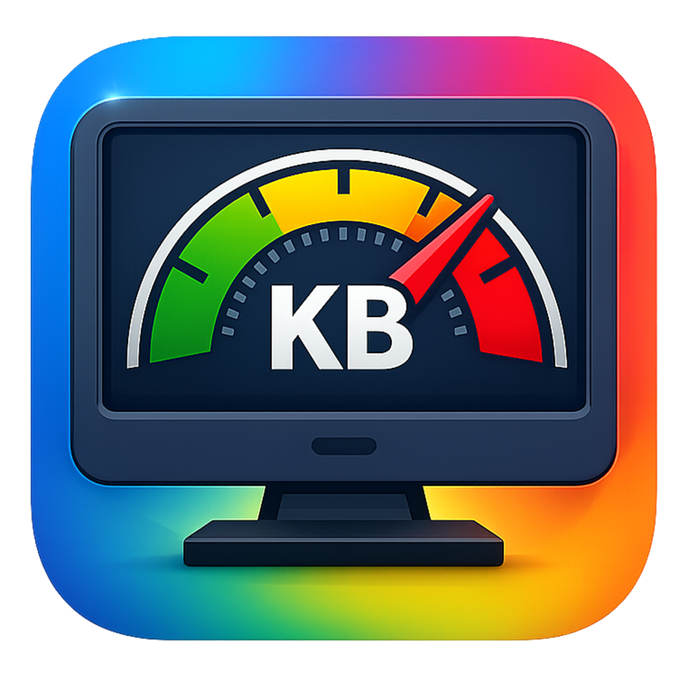

# kil0bit System Monitor

<div align="center">



**A low-latency hardware telemetry overlay for Windows power users.**  
Real-time monitoring of CPU, RAM, Network, and GPU — directly on your taskbar.

[](https://github.com/kil0bit-kb/kil0bit-system-monitor/releases)
[](LICENSE)
[](https://github.com/kil0bit-kb/kil0bit-system-monitor/actions/workflows/ci.yml)

</div>

---

## ✨ Features

- **🖥️ Taskbar Overlay** — Sits directly inside the Windows taskbar using punch-hole transparency. Always visible, never intrusive.
- **📊 Core Four Metrics** — CPU Usage, RAM Usage, Upload/Download Speed, and GPU Usage — all without admin rights or third-party drivers.
- **🎨 Fully Customizable** — Choose accent color, backdrop color and opacity, font family, and display style (Standard / Compact / Icon).
- **🔔 System Tray** — Lives quietly in the system tray. Right-click for quick access to all controls.
- **🚀 Launch on Startup** — Optional auto-start on Windows login via registry.
- **🔒 Lock Position** — Prevent accidental dragging of the overlay.
- **🌑 Dark Native UI** — Settings window built with Slint, styled with dark native Windows aesthetics.
- **⚡ Lightweight** — Pure Rust. No Electron. No .NET. No runtime required.

---

## 📸 Screenshots

> *Coming soon — add your screenshots here!*

---

## 📥 Installation

### Option 1: Download Installer (Recommended)
1. Go to the [**Releases**](https://github.com/kil0bit-kb/kil0bit-system-monitor/releases) page.
2. Download the latest **`kil0bit-system-monitor-setup.msi`** and run it.
3. Launch **kil0bit System Monitor** from the Start Menu or system tray.

### Option 2: Portable EXE
1. Download **`kil0bit-system-monitor.exe`** from [Releases](https://github.com/kil0bit-kb/kil0bit-system-monitor/releases).
2. Place it anywhere and run it directly. No installation needed.

---

## 🔨 Build from Source

### Prerequisites
- [Rust (stable)](https://rustup.rs/) — `rustup install stable`
- Windows 10/11 (64-bit)

### Steps

```sh
# Clone the repository
git clone https://github.com/kil0bit-kb/kil0bit-system-monitor.git
cd kil0bit-system-monitor

# Build in release mode
cargo build --release
```

The compiled binary will be at `target/release/kil0bit-system-monitor.exe`.

---

## 🧰 Tech Stack

| Component | Technology |
|---|---|
| Language | Rust (stable) |
| UI Framework | [Slint](https://slint.dev/) |
| System Info | [sysinfo](https://github.com/GuillaumeGomez/sysinfo) |
| GPU Telemetry | [nvml-wrapper](https://github.com/Cldfire/nvml-wrapper) |
| Windows APIs | [windows-rs](https://github.com/microsoft/windows-rs) |
| Tray Icon | [tray-icon](https://github.com/tauri-apps/tray-icon) |

---

## 🌐 Links

| Platform | Link |
|---|---|
| 📺 YouTube | [@kilObit](https://www.youtube.com/@kilObit) |
| ✍️ Blog | [kil0bit.blogspot.com](https://kil0bit.blogspot.com/) |
| 🐙 GitHub | [kil0bit-kb](https://github.com/kil0bit-kb) |
| 🐦 X (Twitter) | [@kil0bit](https://x.com/kil0bit) |
| ❤️ Patreon | [Support Me](https://www.patreon.com/cw/KB_kilObit) |

---

## 📄 License

This project is licensed under the [MIT License](LICENSE).

---

<div align="center">
Built with ❤️ by <strong>KB - kil0bit</strong>
</div>
